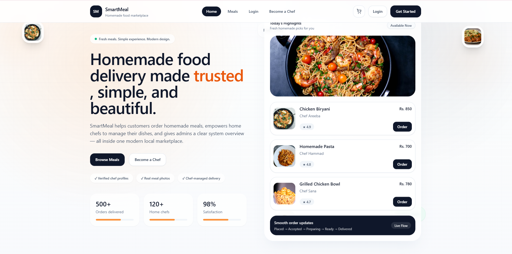
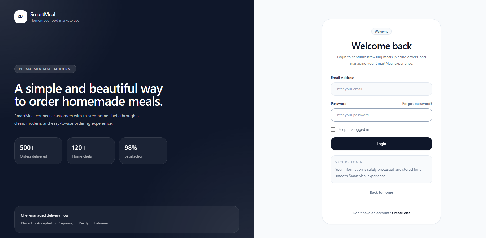
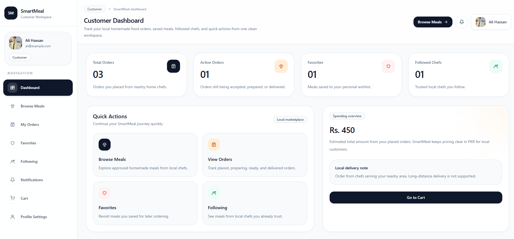
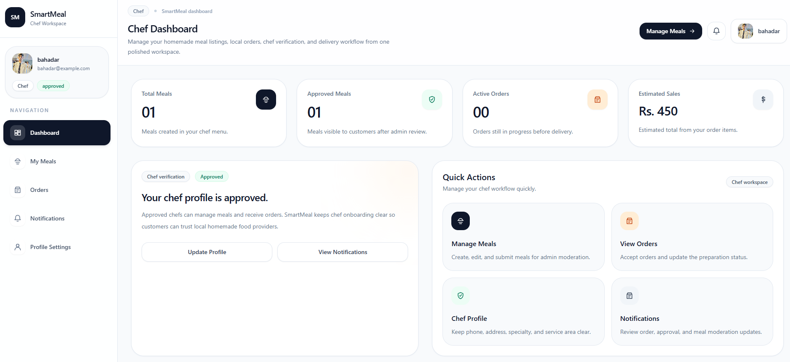
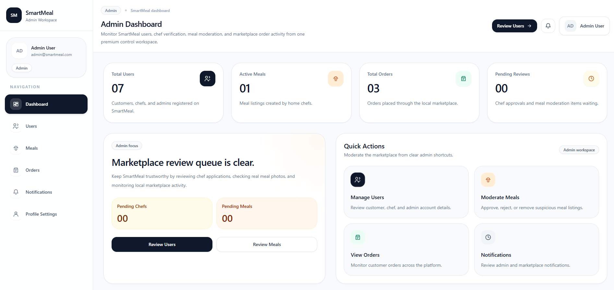

# 🍽️ SmartMeal — Homemade Food Marketplace (FYP)

SmartMeal is a full-stack web application that connects customers with local home chefs, enabling users to discover, order, and enjoy homemade meals with a clean, modern, and trust-focused experience.

---

## 🚀 Project Overview

SmartMeal is designed to solve the problem of:

- Lack of access to homemade food
- Trust issues in online food platforms
- No structured system for home chefs

It provides a **role-based marketplace** with:

- Customers → browse & order meals
- Chefs → manage meals & orders
- Admin → approve users & moderate content

---

## 🎯 Features

### 👤 Customer

- Browse approved meals
- View meal details
- Place orders with delivery info
- Track order status
- Save favorites
- Follow chefs

### 👨‍🍳 Chef

- Create and manage meals
- Upload meal images
- View and update orders
- Profile management

### 🛡️ Admin

- Approve/reject chef accounts
- Moderate meal listings
- View all users, meals, and orders

---

## 🔔 Notifications System

- Email notifications for:
  - Chef approval/rejection
  - Meal approval/rejection
- In-app notification system

---

## 🧱 Tech Stack

### Frontend

- React (Vite)
- Tailwind CSS
- Axios

### Backend

- Node.js
- Express.js
- Sequelize ORM

### Database

- MySQL

### Other

- JWT Authentication
- Multer (Image Uploads)
- Nodemailer (Emails)

---

## 🗂️ Project Structure

SMARTMEAL/
│
├── backend/
│ ├── src/
│ │ ├── config/
│ │ ├── controllers/
│ │ ├── middleware/
│ │ ├── models/
│ │ ├── routes/
│ │ ├── services/
│ │ ├── utils/
│ │ ├── app.js
│ │ └── server.js
│
├── frontend/
│ ├── src/
│ │ ├── components/
│ │ ├── pages/
│ │ ├── services/
│ │ └── App.jsx
│
└── uploads/

---

## ⚙️ Setup Instructions

### 1. Clone the repository

```bash
git clone https://github.com/bahadarali02/smartmeal-fyp.git
cd smartmeal-fyp

 2. Backend Setup
cd backend
npm install

Create .env file:


PORT=5000

DB_HOST=localhost
DB_PORT=3306
DB_NAME=smartmeal_db
DB_USER=root
DB_PASSWORD=smartmeal123

JWT_SECRET=smartmeal_super_secret_key

ENABLE_EMAILS=true
SMTP_HOST=smtp.gmail.com
SMTP_PORT=587
SMTP_SECURE=false
SMTP_USER=bahadarali768@gmail.com
SMTP_PASS=rgli acqz pmhb kfri
SMTP_FROM_NAME=Smart meal
SMTP_FROM_EMAIL=bahadarali768@gmail.com
```
Run backend:

npm run dev


3. Frontend Setup
cd ../frontend
npm install
npm run dev

🧪 Testing Roles
Role	Access
Customer	Browse, Order
Chef	Manage Meals, Orders
Admin	Approvals, Moderation

🔐 Security Features
JWT Authentication
Role-based access control
Protected API routes
Input validation

## 📸 Screenshots
## 📸 Screenshots

### 🏠 Landing Page


### 🔐 Login Page


### 👤 Customer Dashboard


### 👨‍🍳 Chef Dashboard


### 🛡️ Admin Dashboard



📦 Future Enhancements
Online payments integration
Real-time order tracking
Mobile app version
Ratings & reviews system
🎓 Final Year Project

This project is developed as a Final Year Project (FYP) demonstrating:

Full-stack development
Real-world system design
UI/UX principles
Backend architecture
Database design
👨‍💻 Author

Bahadar Ali
Ali Raza

⭐ Acknowledgment

Built for academic learning and demonstration purposes.


---

## Next Step

Now do this:

1. Replace:

YOUR_USERNAME
Your Name


2. Add screenshots later

3. Then commit:

```bash
git add .
git commit -m "Added professional README"
git push